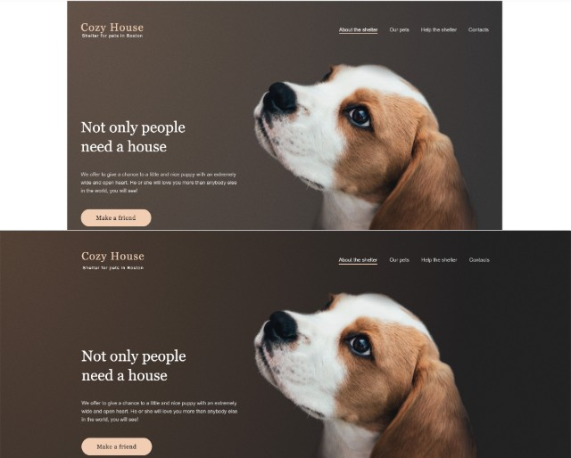

#  Shelter 

1. [Demo Week 1](https://DenViRus.github.io/Shelter/src/pages/main/main.html)
1. [Demo Week 2](https://DenViRus.github.io/Shelter/src/pages/pets/pets.html)

---

**[Shelter. Figma](https://www.figma.com/file/tKcmzkARtMUFQAR9VLdLkl/shelter-dom)**

## Stages of task completion

**[Week 1](#week-1)**: Static markup of the `main` page.

## Layout

- [Figma layout](https://www.figma.com/file/tKcmzkARtMUFQAR9VLdLkl/shelter-dom);

## Technical requirements

The PerfectPixel extension for Google Chrome can be used for comparison with designs. _[PerfectPixel for Google Chrome](https://chrome.google.com/webstore/detail/perfectpixel-by-welldonec/dkaagdgjmgdmbnecmcefdhjekcoceebi?hl=en)_
Compatible browsers: **Google Chrome, Mozilla Firefox**. We primarily develop for Google Chrome. Then we check to see if Mozilla Firefox is breaking our styles.
It's **prohibited** to use CSS frameworks (bootstrap, foundation, etc.).
It's **prohibited** to use JS frameworks (Angular, React, Vue, etc.).
It's **prohibited** to use legacy libraries (jQuery, etc.).
It's **allowed** to use up-to-date libraries with a set of helper functions (lodash). You can use Lodash as well as utils for the creation of a slider, pagination, and popups. However, it's recommended to use pure JavaScript.
It's **allowed** to use icon fonts and CSS preprocessors (SCSS).
It's **recommended** to use [normalize.css](https://necolas.github.io/normalize.css/).
Please pay attention to the following points:

- The main blocks should be exactly located on the given screen width, as in the Figma designs.
- Images and logos (if any) should be located within a logical container with the correct centering and positioning approach. A slight deviation from the layout is allowed in favor of a grid or column structure.
- Icons and pictures should keep the ideal distance to the beginning of the corresponding text.
- Icons and pictures should keep their proportions.
- If the correct font is used, check the height of the text - it should match the source. The width may vary. But the common practice is to add the `letter-spacing` property to the text of headings, mottos, or quotes.
- If there are several objects in a row of visually the same width, then the width of the blocks containing them must be the same. The difference in image sizes does not matter, what matters is the matching of block sizes. If the width of the blocks in the layout is different, then you still need to make it the same.
- Some elements should be interactive. The layout contains separately designed blocks describing what the button or element looks like with and without the hover effect.
  "Interactive" means that a button or element has a visual effect or animation (at your discretion based on the layout: cursor animation, background color change, dimming, underline, font change) during some user action, for example, on hover. It is not necessary to use JavaScript to handle custom events in this task. Usually, this effect is implemented using the `:hover` pseudo-class and the following properties:
- `cursor: pointer`,
- `background`,
- `text-decoration: underline`,
- `color`.

## Repository requirements

- Public repository named shelter on your GitHub account.
- You may use the example of project structure below. Since the project will contain several pages (2), at the same level as `assets` there will be the `pages` directory. Inside `pages`, in the `main` folder (same as the page name), the `.html`, `.css` and `.js` files related to this page will be stored. The `assets` directory will still contain images, icons, and font files if any. The folders inside `assets` will be named depending on the content: `images`, `icons`, `fonts`. Example below:
- 
- You should deploy your task using gh-pages or by any other means.
- The commit history should reflect the development process of the application. Commit names should match the [commit requirements](https://docs.rs.school/#/git-convention)

## Useful links

Fonts can be found here:
[Arial, google fonts](https://www.fonts.com/font/monotype/arial?QueryFontType=Web&src=GoogleWebFonts)
[Georgia, google fonts](https://www.fonts.com/font/microsoft-corporation/georgia?QueryFontType=Web&src=GoogleWebFonts)
You can connect fonts by either downloading local files or connecting fonts via URL to google fonts. If you can't find or download the font you need, just replace it with a font with the same serif type.

## Week 1

The original width of the provided layout is 1280px. The width of the wrapper or guide columns is 1200px. The sizes of internal blocks are recommended to be set in relative values (%, vw) in order not to rewrite CSS styles for responsive layout.
When the window width is above 1280px, the layout should remain centered, and not stretch to the full width of the window. To fill the free space, you can either stretch the backgrounds of the corresponding blocks to the entire width of the window, or use any of the colors present in the [designs](https://www.figma.com/file/tKcmzkARtMUFQAR9VLdLkl/shelter-dom):

JPG: **[shelter. main-1280. JPG](./src/assets/img/readme-img/shelter-main-1280px.jpg)**

1. **Header** (`<header>` contains only the logo and navigation bar)

- Interactive navigation bar:
  - `About the shelter` element should be highlighted by default;
  - highlighted `About the shelter` element may not have hover effects.
- Clicking on `Our pets` takes us to the _our pets_ page.
- Clicking on `Help the shelter` redirects us to the _Help_ block located on the same page (anchor link).
- Clicking on `Contacts` takes us to the _Footer_ block located on the same page (anchor link).
- The logo is located on the left. The logo consists of text elements (i.e. not a picture). Clicking on the logo leaves us on the current page.
- There must be one `<h1>` element on the page. You can make it with the text `Cozy House`.
- There is no need to make the header "sticky". It means what when scrolling, it remains in its position.

2. **Not only** block

- The `Make a Friend` button should be clickable.
- Clicking on `Make a Friend` takes us to the _Our Friends_ block located on the same page (anchor link).
- The background of the blocks can be made with a gradient.
- The image of the dog and the text are different blocks that should not overlap.

3. **About** block

- Carefully look at what kind of quotes are here.

4. **Our Friends** block

- Buttons "left" and "right" should be interactive.
- Pet cards should be interactive when hovering over any area of the card. Hovering over a card changes the cursor, highlights the `Learn more` button, and changes the background.
- `Learn more` buttons should be interactive.
- The `Get to know the rest` button should be interactive.
- Clicking on `Get to know the rest` takes us to the _our pets_ page.

5. **Help** block

- Arrangement of elements: necessarily 5 elements on top and 4 elements on the bottom.

6. **In addition** block

- Interactive block with bank account number. The number should be a link that doesn't lead anywhere.

7. **Footer** (`<footer>` contains contacts, address and image):

- Clicking on an email or its icon should open the mail service.
- Clicking on the phone or its icon should open dialing.
- Clicking on a location should open a page with google maps in a separate window with any location you choose.
- The image of the dog, address and contacts are different blocks that should not overlap.
- The background of the block can be made with a gradient.

## Cross-check evaluation criteria. Week 1

Open the application at 1280px screen width. If the screen is smaller, you can zoom in, or you can set the page width to 1280px and observe with the visible horizontal scrollbar. If the screen is wider, you can make the area narrower or narrow the window. If the vertical scroll is present, in some cases the width may not match the one that displays the value in the dev tools (the offset can be up to 17px). When checking, keep this in mind and make sure that the width is set correctly.
The task is checked exclusively according to the criteria specified below. If you see some kind of defect or mistake in the work that does not match a criterion, the score should not be decreased. But you can highlight it in the comments.
If during the check, you don't know whether to lower the score or not, then you shouldn't. For example, if wrong numbers are entered in the **You can also make a donation** block inside the button, then this will not be considered a mistake, the score shouldn't be reduced.
❗ The score cannot go below **0** per page. Unless otherwise stated in the requirements, all non-repeating blocks or elements without `hover` should meet the following criteria:

- Indents from the borders of elements (or sets of elements) to the edges of the block, horizontally or vertically, differ by more than 20px: **-1** for each block.
- Margins within a set or grid between elements, horizontally or vertically, differ by more than 10px: **-1** per block.
- The background color of the block or element differs from the design (does not apply to the position of the gradient or stretched image): **-1** for each block.
- Missing element or picture, both background and element picture: **-1** for each block.
- font-family is not included, or difference in font size is more than 4px: **-1** per block.
  The _Main page_ is created **+60**.

1. The **Header** block is absent: **-10**.

- There's no logo: **-2**.
- No navbar: **-5**. The navigation bar is present, but not interactive: **-1**. It is recommended to use `<nav>`.
- The `About the shelter` element is not highlighted: **-1**.
- The `Our pets` element does not work as a link to the _our pets_: **-1** page.
- The `Help the shelter` element does not work as an anchor link to the _Help_ block: **-1**.
- The `Contacts` element does not work as an anchor link to the _Footer_ block: **-1**.
- There is no `<h1>` element on the page: **-2**. There is an `<h1>` element, but there is more than one: **-1**.
- The background significantly differs from what is on the designs (does not mean a shifted image or gradient): **-1**.

2. The **Not only** block is absent: **-5**.

- The `Make a Friend` is absent: **-2**. The button is present, but not interactive, or does not work as an anchor link to the _Our Friends_: **-1** block.
- The background significantly differs from what is on the designs (does not mean a shifted image or gradient): **-1**.
- There's no image of a dog: **-2**. There is a image of a dog, but it is significantly shifted, or overlapped on the text or other blocks: **-1**.

3. The **About** block is absent: **-5**.

- There's no image of a cat and a dog: **-2**. There is a image of a dog, but it is significantly shifted, or overlapped on the text or other blocks: **-1**.
- Header text has incorrect dimensions: **-2**.
- The quotation marks are not in the correct form: **-1**.

4. The **Our Friends** block is absent: **-20**.

- There's no "left" button: **-2**. The button is present, but it is not interactive: **-1**.
- There's no "right" button: **-2**. The button is present, but it is not interactive: **-1**.
- There're no pet cards: **-10**. The pet cards are present, but at the same time:
  - The grid structure of the elements is broken: **-2**.
  - The number of cards does not match the designs: **-2**.
  - The structure of the cards is broken (for example, text or a button is located above the image): **-2**.
  - Cards are not interactive: **-2**.
  - `Learn more` buttons don't change color when hovering over the card: **-2**.
- There's no `Get to know the rest` button: **-2**. The button is present, but not interactive, or doesn't work as a link to the _our pets_ page: **-1**.

5. The **Help** block is absent: **-5**.

- The grid structure of the elements is broken (not 5 elements from above, 4 from below): **-2**.
- Image of one or more icons missing: **-2**.
- The structure is broken (e.g. text above or icon below) in one or more elements: **-1**.

6. The **In addition** block is absent: **-5**.

- There's no bank account button: **-2**. The button is present, but not interactive, or is not a link: **-1**.
- There's no image of a dog: **-2**. There is a image of a dog, but it is significantly shifted, or overlapped on the text or other blocks: **-1**.

7. The **Footer** block is absent: **-10**.

- The grid structure of the elements is broken: **-2**.
- The `email` element does not work as a link to a mail service: **-2**.
- The `phone` element does not work as a call service link: **-2**.
- At least one `location` element does not work as a link to google maps: **-1**.
- There's no image of a dog: **-2**. There is a image of a dog, but it is significantly shifted, or overlapped on the text or other blocks: **-1**.
- The background significantly differs from what is on the designs (does not mean a shifted image or gradient): **-1**.

## Week 2

JPG: **[shelter. Pets page. JPG](./src/assets/img/readme-img/shelter-pets-1280px.jpg)**

1. **Header** (`<header>` contains only the logo and navigation bar)

- Interactive navigation bar:
  - `Our pets` element should be highlighted by default;
  - highlighted `Our pets` element may not have hover effects.
- Clicking on `About the shelter` takes us to the the _main page_
- Clicking on `Help the shelter` redirects us to the _Help_ block located on the _main page_ (anchor link).
- Clicking on `Contacts` takes us to the _Footer_ block located on the same page (anchor link).
- The logo is located on the left. The logo consists of text elements (i.e. not a picture). Clicking on the logo takes us to the _main page_.
- There must be one `<h1>` element on the page. You can make it with the text `Cozy House`.
- There is no need to make the header "sticky". It means what when scrolling, it remains in its position.

2. **Our Friends** block

- Four-column layout.
- Pet cards should be interactive when hovering over any area of the card. Hovering over a card changes the cursor, highlights the `Learn more` button, and changes the background.
- It is not necessary to open a modal window when clicking at this stage.
- Pagination should be clickable on available buttons. This means that from position (1) we cannot go further to the left, i.e. to the smaller side. Gray buttons must have the attribute `disabled`, `data-disabled` or a modifier class.

3. **Footer** (`<footer>` contains contacts, address and image):

- Clicking on an email or its icon should open the mail service.
- Clicking on the phone or its icon should open dialing.
- Clicking on a location should open a page with google maps in a separate window with any location you choose.
- The image of the dog, address and contacts are different blocks that should not overlap.
- The background of the block can be made with a gradient.

## Cross-check evaluation criteria. Week 2

The _Our pets_ page is created **+40**.

1. The **Header** block is absent: **-10**.

- There's no logo: **-2** The logo is present, but does not work as a link to the _Main page_: **-1**.
- No navbar: **-5**. The navigation bar is present, but not interactive: **-1**. It is recommended to use `<nav>`.
- The `About the shelter` element does not work as a link to the _Main page_: **-1**.
- The `Our pets` element is not highlighted: **-1**.
- The `Help the shelter` element does not work as an anchor link to the _Help_ block of the _Main page_: **-1**.
- The `Contacts` element does not work as an anchor link to the _Footer_ block of the same page: **-1**.
- There is no `<h1>` element on the page: **-2**. There is an `<h1>` element, but there is more than one: **-1**.
- The background significantly differs from what is on the designs (does not mean a shifted image or gradient): **-1**.

2. The **Our Friends** block is absent: **-20**.

- There're no pagination buttons: **-10**. There is a button, but:
  - Buttons are of the same color or background: **-2**.
  - The buttons are in the wrong order: **-2**.
  - Buttons "left" interactive: **-1**.
  - Buttons "right" are not interactive: **-1**.
  - There is no number on the page circle, or the number is different from one: **-1**.
  - The page circle is interactive: **-1**.
- There're no pet cards: **-10**. The pet cards are present, but at the same time:
  - The grid structure of the elements is broken: **-2**.
  - The number of cards does not match the designs: **-2**.
  - The structure of the cards is broken (for example, text or a button is located above the image): **-2**.
  - Cards are not interactive: **-2**.
  - `Learn more` buttons don't change color when hovering over the card: **-2**.

3. The **Footer** block is absent: **-10**.

- The grid structure of the elements is broken: **-2**.
- The `email` element does not work as a link to a mail service: **-2**.
- The `phone` element does not work as a call service link: **-2**.
- At least one `location` element does not work as a link to google maps: **-1**.
- There's no image of a dog: **-2**. There is a image of a dog, but it is significantly shifted, or overlapped on the text or other blocks: **-1**.
- The background significantly differs from what is on the designs (does not mean a shifted image or gradient): **-1**.

---
