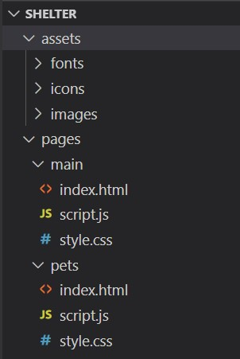
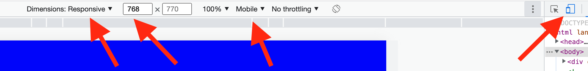

#  Shelter 

1. [Demo Week 3](https://DenViRus.github.io/Shelter/src/pages/main/main.html)

---

**[Shelter. Figma](https://www.figma.com/file/tKcmzkARtMUFQAR9VLdLkl/shelter-dom)**

## Stages of task completion

**[Week 1](#week-1)**: Static markup of the `main` page.

## Layout

- [Figma layout](https://www.figma.com/file/tKcmzkARtMUFQAR9VLdLkl/shelter-dom);

## Technical requirements

The PerfectPixel extension for Google Chrome can be used for comparison with designs. _[PerfectPixel for Google Chrome](https://chrome.google.com/webstore/detail/perfectpixel-by-welldonec/dkaagdgjmgdmbnecmcefdhjekcoceebi?hl=en)_
Compatible browsers: **Google Chrome, Mozilla Firefox**. We primarily develop for Google Chrome. Then we check to see if Mozilla Firefox is breaking our styles.
It's **prohibited** to use CSS frameworks (bootstrap, foundation, etc.).
It's **prohibited** to use JS frameworks (Angular, React, Vue, etc.).
It's **prohibited** to use legacy libraries (jQuery, etc.).
It's **allowed** to use up-to-date libraries with a set of helper functions (lodash). You can use Lodash as well as utils for the creation of a slider, pagination, and popups. However, it's recommended to use pure JavaScript.
It's **allowed** to use icon fonts and CSS preprocessors (SCSS).
It's **recommended** to use [normalize.css](https://necolas.github.io/normalize.css/).
Please pay attention to the following points:

- The main blocks should be exactly located on the given screen width, as in the Figma designs.
- Images and logos (if any) should be located within a logical container with the correct centering and positioning approach. A slight deviation from the layout is allowed in favor of a grid or column structure.
- Icons and pictures should keep the ideal distance to the beginning of the corresponding text.
- Icons and pictures should keep their proportions.
- If the correct font is used, check the height of the text - it should match the source. The width may vary. But the common practice is to add the `letter-spacing` property to the text of headings, mottos, or quotes.
- If there are several objects in a row of visually the same width, then the width of the blocks containing them must be the same. The difference in image sizes does not matter, what matters is the matching of block sizes. If the width of the blocks in the layout is different, then you still need to make it the same.
- Some elements should be interactive. The layout contains separately designed blocks describing what the button or element looks like with and without the hover effect.
  "Interactive" means that a button or element has a visual effect or animation (at your discretion based on the layout: cursor animation, background color change, dimming, underline, font change) during some user action, for example, on hover. It is not necessary to use JavaScript to handle custom events in this task. Usually, this effect is implemented using the `:hover` pseudo-class and the following properties:
- `cursor: pointer`,
- `background`,
- `text-decoration: underline`,
- `color`.

## Repository requirements

- Public repository named shelter on your GitHub account.
- You may use the example of project structure below. Since the project will contain several pages (2), at the same level as `assets` there will be the `pages` directory. Inside `pages`, in the `main` folder (same as the page name), the `.html`, `.css` and `.js` files related to this page will be stored. The `assets` directory will still contain images, icons, and font files if any. The folders inside `assets` will be named depending on the content: `images`, `icons`, `fonts`. Example below:
- 
- You should deploy your task using gh-pages or by any other means.
- The commit history should reflect the development process of the application. Commit names should match the [commit requirements](https://docs.rs.school/#/git-convention)

## Useful links

Fonts can be found here:
[Arial, google fonts](https://www.fonts.com/font/monotype/arial?QueryFontType=Web&src=GoogleWebFonts)
[Georgia, google fonts](https://www.fonts.com/font/microsoft-corporation/georgia?QueryFontType=Web&src=GoogleWebFonts)
You can connect fonts by either downloading local files or connecting fonts via URL to google fonts. If you can't find or download the font you need, just replace it with a font with the same serif type.

## Week 1

The original width of the provided layout is 1280px. The width of the wrapper or guide columns is 1200px. The sizes of internal blocks are recommended to be set in relative values (%, vw) in order not to rewrite CSS styles for responsive layout.
When the window width is above 1280px, the layout should remain centered, and not stretch to the full width of the window. To fill the free space, you can either stretch the backgrounds of the corresponding blocks to the entire width of the window, or use any of the colors present in the [designs](https://www.figma.com/file/tKcmzkARtMUFQAR9VLdLkl/shelter-dom):

JPG: **[shelter. main-1280. JPG](./src/assets/img/readme-img/shelter-main-1280px.jpg)**

1. **Header** (`<header>` contains only the logo and navigation bar)

- Interactive navigation bar:
  - `About the shelter` element should be highlighted by default;
  - highlighted `About the shelter` element may not have hover effects.
- Clicking on `Our pets` takes us to the _our pets_ page.
- Clicking on `Help the shelter` redirects us to the _Help_ block located on the same page (anchor link).
- Clicking on `Contacts` takes us to the _Footer_ block located on the same page (anchor link).
- The logo is located on the left. The logo consists of text elements (i.e. not a picture). Clicking on the logo leaves us on the current page.
- There must be one `<h1>` element on the page. You can make it with the text `Cozy House`.
- There is no need to make the header "sticky". It means what when scrolling, it remains in its position.

2. **Not only** block

- The `Make a Friend` button should be clickable.
- Clicking on `Make a Friend` takes us to the _Our Friends_ block located on the same page (anchor link).
- The background of the blocks can be made with a gradient.
- The image of the dog and the text are different blocks that should not overlap.

3. **About** block

- Carefully look at what kind of quotes are here.

4. **Our Friends** block

- Buttons "left" and "right" should be interactive.
- Pet cards should be interactive when hovering over any area of the card. Hovering over a card changes the cursor, highlights the `Learn more` button, and changes the background.
- `Learn more` buttons should be interactive.
- The `Get to know the rest` button should be interactive.
- Clicking on `Get to know the rest` takes us to the _our pets_ page.

5. **Help** block

- Arrangement of elements: necessarily 5 elements on top and 4 elements on the bottom.

6. **In addition** block

- Interactive block with bank account number. The number should be a link that doesn't lead anywhere.

7. **Footer** (`<footer>` contains contacts, address and image):

- Clicking on an email or its icon should open the mail service.
- Clicking on the phone or its icon should open dialing.
- Clicking on a location should open a page with google maps in a separate window with any location you choose.
- The image of the dog, address and contacts are different blocks that should not overlap.
- The background of the block can be made with a gradient.

## Week 2

JPG: **[shelter. Pets page. JPG](./src/assets/img/readme-img/shelter-pets-1280px.jpg)**

1. **Header** (`<header>` contains only the logo and navigation bar)

- Interactive navigation bar:
  - `Our pets` element should be highlighted by default;
  - highlighted `Our pets` element may not have hover effects.
- Clicking on `About the shelter` takes us to the the _main page_
- Clicking on `Help the shelter` redirects us to the _Help_ block located on the _main page_ (anchor link).
- Clicking on `Contacts` takes us to the _Footer_ block located on the same page (anchor link).
- The logo is located on the left. The logo consists of text elements (i.e. not a picture). Clicking on the logo takes us to the _main page_.
- There must be one `<h1>` element on the page. You can make it with the text `Cozy House`.
- There is no need to make the header "sticky". It means what when scrolling, it remains in its position.

2. **Our Friends** block

- Four-column layout.
- Pet cards should be interactive when hovering over any area of the card. Hovering over a card changes the cursor, highlights the `Learn more` button, and changes the background.
- It is not necessary to open a modal window when clicking at this stage.
- Pagination should be clickable on available buttons. This means that from position (1) we cannot go further to the left, i.e. to the smaller side. Gray buttons must have the attribute `disabled`, `data-disabled` or a modifier class.

3. **Footer** (`<footer>` contains contacts, address and image):

- Clicking on an email or its icon should open the mail service.
- Clicking on the phone or its icon should open dialing.
- Clicking on a location should open a page with google maps in a separate window with any location you choose.
- The image of the dog, address and contacts are different blocks that should not overlap.
- The background of the block can be made with a gradient.

## Week 3

- **[Repository requirements](#repository-requirements)**
- **[First paragraph in a section: Cross-check evaluation criteria. Week 1](#cross-check-evaluation-criteria-week-1)**

### Task verification features

The task will be evaluated by resizing the Google Chrome browser window, or by connecting device emulation through the developer panel (DevTools -> Toggle Device Toolbar). Evaluation the project on real mobile devices or tablets is **not required**.
❗ Make sure you don't have a vertical scroll bar when you check, because it takes part of the responsive layout space with its width. To disable it, you must select the `Responsive` emulation mode, as well as set the device type to `Mobile`. If the device type is not displayed, in the top bar of the `device toolbar`, click on the three dots on the right and select `Add device type`.

**"responsive"** are sizes given in relative values from the width of the window or parent block, which smoothly change their values when the browser window is reduced or enlarged. The main thing is that when imposing a picture, for example, at 768px on a layout with a width of 768px, the sizes or indents should match.
❗ The page should not fall apart, which means that padding, block sizes, and so on, should not go beyond the right edge of the screen and there should not be a horizontal scroll, up to a threshold value (less than 320px).

## 1280px <= width

The layout requirements of [week 1](#week-1) of the project are met: either the blocks continue their color to the entire available area of the window, and the wrapper itself (1200px) is centered (the gradient can also change the width), or the layout takes a maximum width of 1280px and centered with equal indents on the right and left, white or any other color from the layout (when checking, if it will be difficult to see the integrity on a large screen, you can set the body element's background-color property of any contrasting color in the developer panel).

## 768px <= width < 1280px

### Main Page

1. **Header** (`<header>` contains only the logo and navigation bar)

- The logo is nailed closer to the top of the page.
- Padding to the left of the logo and to the right of the navigation menu must be hardcoded, as in the `768px` layout.
- There is no need to make the header "sticky". It means that when scrolling, it remains in its position.

2. **Not only** section

- The title with the text "Not only people need a house" should be positioned as indicated on the layout, i.e. the line wrapping must match the layout. To do so, you can make an additional wrapper, which is centered relative to the main blocks. Only indentation can be `responsive`, but the indentation on the left must match the indentation of the next block of text.
- The block with the text "We offer to give..." should be centered with equal margins on the edges. Block with text and padding can be `responsive`.
- The "Make a Friend" button should be centered and rigidly sized like the `768px` layout.
- The dog picture can be `responsive`, but the offset to the right must remain proportional, i.e. padding to the right margin can also be `responsive`.

3. **About** section

- The title with the text "About the shelter..." should be positioned as indicated on the layout, i.e. the line wrapping must match the layout. To do so, you can make an additional wrapper, which is centered relative to the main blocks. Only indentation can be `responsive`, but the indentation on the left must match the indentation of the next block of text.
- Blocks with the text "Currently..." and "We feed our..." should be centered with equal margins on the edges. Block with text and padding can be `responsive`.
- A picture of a cat and a dog, its indents can be `responsive`. The main thing is that the picture is centered.

4. **Our Friends** section

- The header block must be centered. Block with text and padding can be `responsive`.
- Instead of three blocks with pets, there should now be two. Pet blocks are rigidly sized, as in the `assets` layout. In this case, the indents between blocks, slider arrows or screen edges can be `responsive`.
- The "Get to know the rest" button should be centered and rigidly sized like the `768px` layout.

5. **Help** section

- The header block must be centered. Block with text and padding can be `responsive`.
- Elements are arranged in a 3 x 3 grid. Either the grid increases in proportion to the size of the screen or the indents between the elements and the edges of the screen can be `responsive`. The grid structure should not change.

6. **In addition** section

- The block with the text "You can..." must be positioned as indicated on the layout, i.e. line wrapping must match the layout. To do so, you can make an additional wrapper, which is centered relative to the main blocks. Only indentation can be `responsive`, but the indentation on the left must match the indentation of the next block of text.
- The block with the "Name of the bank..." text should be located as indicated on the layout. To do so, you can make an additional wrapper, which is centered relative to the main blocks. Only padding can be `responsive`, but the left padding must match the next button padding.
- The button with the bank account number should be located as indicated on the layout and have a fixed size, as on the `768px` layout. To do so, you can make an additional wrapper, which is centered relative to the main blocks. Only indentation can be `responsive`, but the indentation on the left must match the indentation of the next block of text.
- The block with the "Legal information..." text should be centered with equal margins on the edges. Block with text and padding can be `responsive`.
- Dog picture and padding can be `responsive`. The main thing is that the picture is centered.

7. **Footer** (`<footer>` contains contacts, address and image):

- There is a grid of two columns. Please note that the grid block itself must be centered, i.e. the distance to the left of the first column is the same as the distance to the right of the second column. In this case, the columns themselves and indents can be `responsive`.
- Dog picture and padding can be `responsive`. The main thing is that the picture is centered.

### Pets Page

1. **Header** (`<header>` содержит только логотип и панель навигации)
1. **Header** (`<header>` contains only the logo and navigation bar)

- The logo is nailed closer to the top of the page.
- Padding to the left of the logo and to the right of the navigation menu must be hardcoded, as in the `768px` layout.
- There is no need to make the header "sticky". It means that when scrolling, it remains in its position.

2. **Our Friends** section

- Heading text should be centered. Block with text and padding can be `responsive`.
- Grid becomes 2 x 3. Pet blocks are rigidly sized like in the `assets` layout. In this case, the indents between blocks or screen edges can be `responsive`.
- Block with buttons should be centered. Button sizes and spacings are hardcoded, like on `assets`, or like on the `768px` layout. Padding to the edges of the screen can be `responsive`.

3. **Footer** (`<footer>` contains contacts, address and image):

- There is a grid of two columns. Please note that the grid box itself must be centered, i.e. the distance to the left of the first column is the same as the distance to the right of the second column. In this case, the columns themselves and indents can be `responsive`.
- Dog picture and padding can be `responsive`. The main thing is that the picture is centered.

## 320px <= width < 768px

### Main Page

1. **Header** (`<header>` only contains logo and burger menu)

- The navigation menu is transformed into the burger menu, which will open on click and offer the familiar navigation bar. The logo is duplicated in the open menu, although it's not visible on the layout. However, if you implemented it so that the menu opens and the logo disappears from the main page - it's not a mistake, and the score will not be reduced.
- The indent to the left of the logo can be `responsive`. The padding to the right of the navigation menu should be hardcoded, as in the `320px` layout.
- There is no need to make the header "sticky". It means that when scrolling, it remains in its position.

2. **Not only** section

- The title with the "Not only people need a house" text should be centered with equal margins around the edges. Block with text and padding can be `responsive`.
- The block with the "We offer to give..." text should be centered with equal margins on the edges. Block with text and padding can be `responsive`.
- The "Make a Friend" button should be centered and rigidly sized like the `320px` layout.
- The dog picture can be `responsive`, but the offset to the right must remain proportional, i.e. padding to the right margin can also be `responsive`.

3. **About** section

- The title with the "About the shelter..." text should be centered with equal margins around the edges. Block with text and padding can be `responsive`.
- Blocks with the "Currently..." text and "We feed our..." should be centered with equal margins on the edges. Block with text and padding can be `responsive`.
- Cat and dog picture and padding can be `responsive`. The main thing is that the picture is centered.

4. **Our Friends** section

- The block header must be centered. Block with text and padding can be `responsive`.
- Instead of two blocks with pets, there should be one for now. The pet block has rigid dimensions, as in the `assets` layout. In this case, the padding between slider arrows or screen edges can be `responsive`.
- The "Get to know the rest" button should be centered and rigidly sized like the `320px` layout.

5. **Help** section

- The block header must be centered. Block with text and padding can be `responsive`.
- Elements are arranged in a grid, 2 x 5. Either the grid increases in proportion to the size of the screen, or the indents between the elements and the edges of the screen can be made `responsive`. The grid structure should not change. The last ninth element of the grid should be in the grid on the left.

6. **In addition** section

- Block with the "You can..." text should be centered. Block with text and padding can be `responsive`.
- The block with the "Name of the bank..." text should be centered. Block with text and padding can be `responsive`.
- The button with the bank account number must be centered. The button itself, as well as padding to the edges of the screen, can be `responsive`.
- The block with the text "Legal information..." should be centered with equal margins on the edges. Block with text and padding can be `responsive`.
- Dog picture and padding can be `responsive`. The main thing is that the picture is centered.

7. **Footer** (`<footer>` contains text, logo and navigation bar):

- One single column. The indents of all elements to the edges of the screen must match. The column itself must be centered. At the same time, both the column itself and the indents to the edges of the screen can be `responsive`.
- Dog picture and padding can be `responsive`. The main thing is that the picture is centered.

### Pets Page

1. **Header** (`<header>` only contains logo and burger menu)

- The navigation menu is transformed into the burger menu, which will open on click and offer the familiar navigation bar. The logo is duplicated in the open menu, although this is not visible on the layout. However, if you made the menu open and the logo disappears from the main page - this is not a mistake, the points will not be reduced.
- The indent to the left of the logo can be `responsive`. The padding to the right of the navigation menu must be hardcoded, as in the `320px` layout.
- There is no need to make the header "sticky". It means that when scrolling, it remains in its position.

2. **Our Friends** section

- The block header must be centered. Block with text and padding can be `responsive`.
- Grid becomes 1 x 3. Pet blocks are rigidly sized like in the `assets` layout. In this case, the indents between blocks or screen edges can be `responsive`.
- Block with buttons should be centered. Button sizes and spacings are hardcoded, like on `assets`, or like on the `320px` layout. Padding to the edges of the screen can be `responsive`.

3. **Footer** (`<footer>` contains contacts, address and image):

- One single column. The indents of all elements to the edges of the screen must match. The column itself must be centered. At the same time, both the column itself and the indents to the edges of the screen can be `responsive`.
- Dog picture and padding can be `responsive`. The main thing is that the picture is centered.

## width < 320px

Minimum layout width = 320px. After the threshold value, the location of the layout does not matter. The layout structure remains the same with a width of 320px. If at some moment during screen resolution reduction the layout "breaks" it's not a mistake.

---
